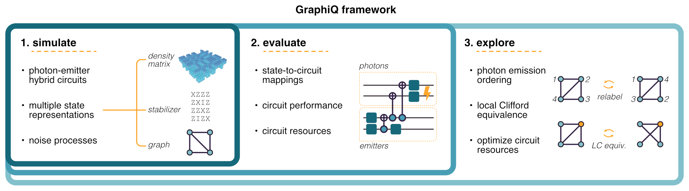

# GraphiQ: Quantum circuit design for photonic graph states
[](https://github.com/ki3-qbt/graph-compiler/actions)
[](https://github.com/ki3-qbt/graph-compiler/tree/gh-pages)

[](https://github.com/ambv/black)


!!! note
    Welcome to GraphiQ. 
    This documentation is still under development, please feel to contribute! 
    © Ki3 Photonics Technologies, Quantum Bridge Technologies

[//]: # (![QBT Logo]&#40;img/qbt-logo.jpg&#41;)
[//]: # (![Ki3 Logo]&#40;img/ki3-logo.png&#41;)


## What can it do?



## About the project
**GraphiQ** is a Python library for the design of quantum photonic circuits.


## Basic usage
``` py
import graphiq as gq
from graphiq.benchmarks.circuits import bell_state_circuit
import networkx as nx

#%%
circuit, _ = bell_state_circuit()
backend = gq.StabilizerCompiler()
state = backend.compile(circuit)
print(state)

#%%
target = gq.QuantumState(data=nx.Graph([(1, 2), (2, 3)]), rep_type="g")
metric = gq.Infidelity(target=target)
solver = gq.DeterministicSolver(compiler=backend, metric=metric, target=target)

#%%
solver.solve()
score, circuit = solver.result
circuit.draw_circuit()
```

## Installation
``` bash
pip install graphiq 
```
This package is built on top of the standard Python scientific computing ecosystem, including
`networkx`, `numpy`, `matplotlib`, and `scipy`.