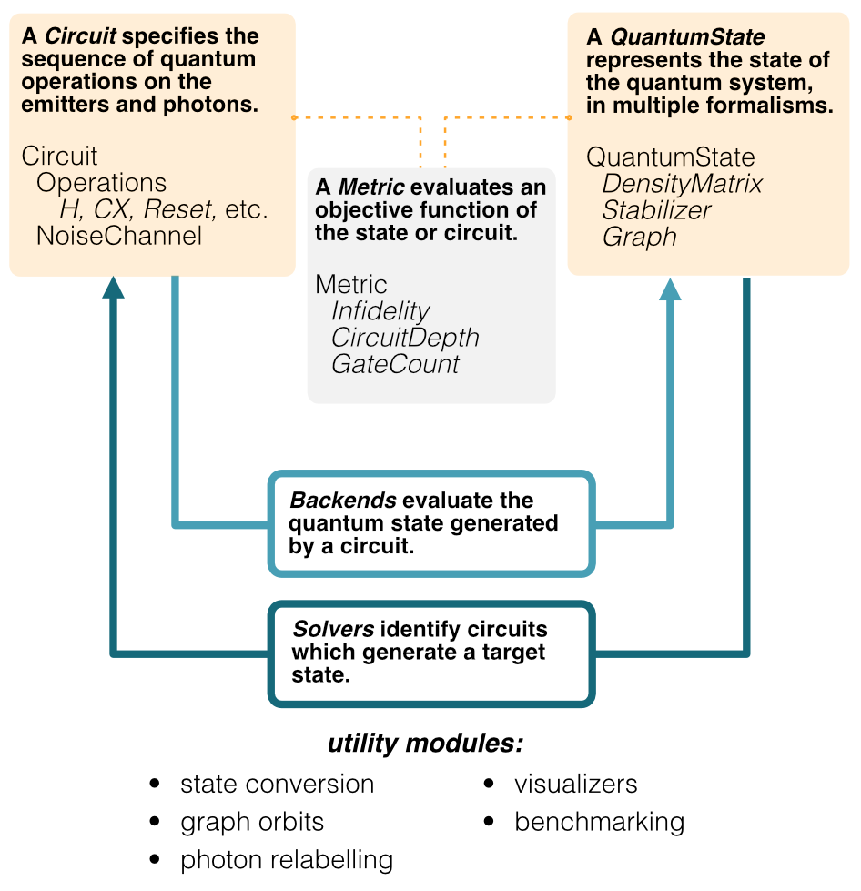

# Welcome to GraphiQ
!!! note
    Welcome to GraphiQ. 
    This documentation is still under development, please feel to contribute! 
    © Ki3 Photonics Technologies, Quantum Bridge Technologies

[//]: # (![QBT Logo]&#40;img/qbt-logo.jpg&#41;)
[//]: # (![Ki3 Logo]&#40;img/ki3-logo.png&#41;)



## Contents
1. [Tutorials](tutorials.md)
2. [How-To Guides](how-to-guides.md)
3. [Reference](reference.md)
4. [Explanation](explanation.md)


## Installation
```
pip install graphiq 
```
    
## 


