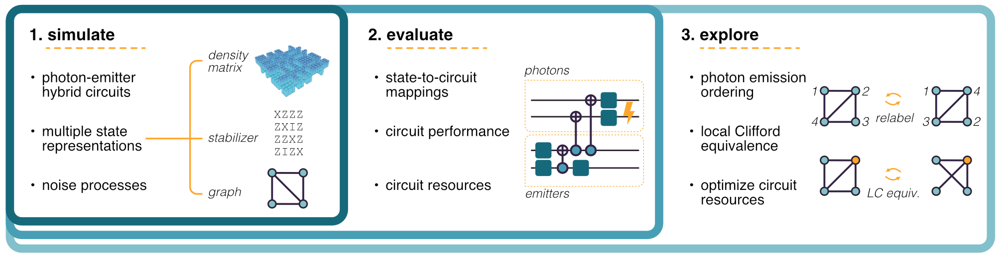

# GraphiQ: Quantum circuit design for photonic graph states

[](https://github.com/ki3-qbt/graph-compiler/actions)
[](https://github.com/ki3-qbt/graph-compiler/tree/gh-pages)
[](https://github.com/ambv/black)


!!! note

    Welcome to GraphiQ.
    This documentation is still under development, please feel to contribute!

    © Quantum Bridge Technologies, Inc
    © Ki3 Photonics Technologies

## What can it do?



## About the project
**GraphiQ** is an open-source framework for designing photonic graph state generation schemes. Photonic graph states are an important resource for many quantum information processing tasks including quantum computing and
quantum communication.

Version 0.1.0 was jointly developed by [Quantum Bridge Technologies, Inc. ("Quantum Bridge") ](https://qubridge.io/)
and [Ki3 Photonics Technologies](https://www.ki3photonics.com/)
under the US Air Force Office of Scientific Research (AFOSR) Grant FA9550-22-1-0062.

## Basic usage

``` py
import graphiq as gq
from graphiq.benchmarks.circuits import bell_state_circuit
import networkx as nx

#%%
circuit, _ = bell_state_circuit()
backend = gq.StabilizerCompiler()
state = backend.compile(circuit)
print(state)

#%%
target = gq.QuantumState(data=nx.Graph([(1, 2), (2, 3)]), rep_type="g")
metric = gq.Infidelity(target=target)
solver = gq.TimeReversedSolver(compiler=backend, metric=metric, target=target)

#%%
solver.solve()
score, circuit = solver.result
circuit.draw_circuit()
```

## Installation
``` bash
pip install graphiq
```

This package is built on top of the standard Python scientific computing ecosystem, including
`networkx`, `numpy`, `matplotlib`, and `scipy`.
